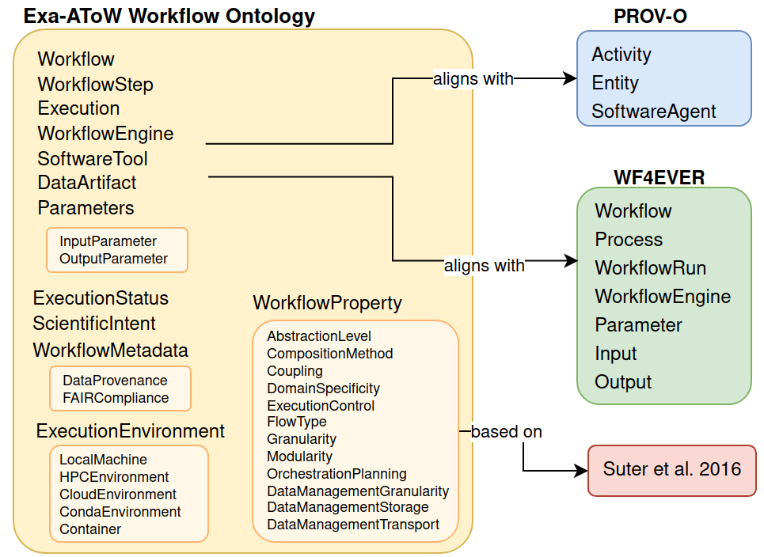
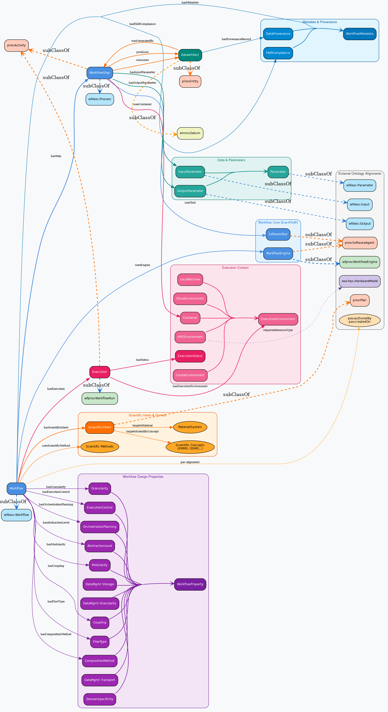

# Exa-AToW Workflow Ontology

## Overview

The **Exa-AToW Workflow Ontology** provides a semantic framework for describing scientific workflows, execution environments, provenance, workflow properties, and interoperability across heterogeneous Workflow Management Systems (WMS).

The ontology extends and aligns with established semantic web standards, including:

- **W3C PROV-O** for provenance representation
- **WF4EVER** ontologies (`wfdesc` and `wfprov`) for workflow description and provenance
- A workflow property framework inspired by **Suter et al. (2026)** for describing workflow design and execution characteristics

The ontology is designed to support reproducibility, interoperability, FAIR workflows, and the semantic characterization of complex computational pipelines.

---

## Resources

### Ontology File (Turtle)

https://w3id.org/Exa-AToW/exato-wf.ttl

### Documentation

https://cnherrera.github.io/Exa-AToW_onto/workflow_ontology/index-en.html

---

## Main Objectives

The ontology aims to:

- Provide a common semantic representation for scientific workflows
- Enable interoperability across multiple workflow management systems
- Capture execution provenance and workflow lifecycle information
- Describe workflow architecture and execution properties
- Support FAIR workflow practices and metadata enrichment
- Facilitate reproducibility and workflow sharing

---

## Key Features

### Workflow Modeling

Represents workflows, workflow steps, sub-workflows, dependencies, and execution logic.

### Execution Tracking

Describes execution environments such as:

- Local machines
- HPC infrastructures
- Cloud platforms
- Containers and virtualized environments

It also models execution status, runtime metadata, and execution provenance.

### Parameter and Data Representation

Supports semantic descriptions of:

- Input and output parameters
- Data types and formats
- Data artifacts and intermediate products
- Storage and transport mechanisms

### Cross-WMS Interoperability

Designed to bridge heterogeneous workflow systems by providing a common semantic layer for workflow description and execution metadata.

### Workflow Property Framework

Captures workflow design and execution characteristics including:

- Granularity
- Modularity
- Flow type
- Coupling
- Data management strategies
- Execution patterns

This component is based on the framework proposed by:

> Suter, F., et al. (2026). *Future Generation Computer Systems*  
> DOI: https://doi.org/10.1016/j.future.2025.107974

### Provenance Integration

Provides native integration with PROV-O concepts to support:

- Data lineage
- Activity tracing
- Agent attribution
- Reproducibility tracking

### FAIR Workflow Support

Includes metadata structures that facilitate:

- **Findability**
- **Accessibility**
- **Interoperability**
- **Reusability**

of workflows and workflow-related resources.

---

## Ontology Alignment

The Exa-AToW Workflow Ontology aligns with community standards to maximize semantic interoperability and reuse.

### Integrated Standards

| Standard | Purpose |
|---|---|
| **PROV-O** | Provenance modeling |
| **WF4EVER (`wfdesc`)** | Workflow structure description |
| **WF4EVER (`wfprov`)** | Workflow execution provenance |
| **Suter et al. framework** | Workflow property characterization |

The ontology extends these standards with additional concepts required for modern scientific workflow ecosystems.

### Alignment Diagram

Conceptual structure of the Exa-AToW Workflow Ontology illustrating alignments with **PROV-O** and **WF4EVER**.

---

## Ontology Structure

The ontology includes conceptual modules for:

- Workflow definitions
- Workflow executions
- Workflow steps and dependencies
- Execution environments
- Data entities and parameters
- Provenance information
- Workflow properties
- FAIR metadata support

### Ontology Overview Diagram

---

## Example Use Cases

The ontology can support:

- Scientific workflow catalogues
- Workflow reproducibility platforms
- HPC and cloud workflow tracking
- Provenance-aware workflow repositories
- FAIR workflow assessment systems
- Cross-platform workflow interoperability
- Workflow analytics and characterization

---

## Citation

If you use the Exa-AToW Workflow Ontology in your work, please cite the related publications and ontology repository.

---

## Repository

https://github.com/logistica-dev/exa-atow-ontologies

---

## License

CC-BY 4.0

---

## Contact

For questions, issues, or contributions, please use the repository issue tracker:

https://github.com/logistica-dev/exa-atow-ontologies/issues

